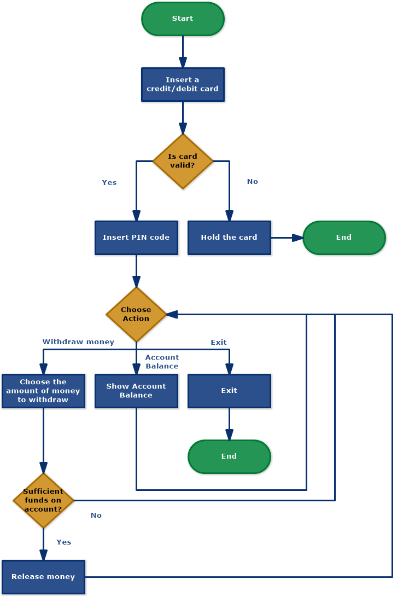

# ATM System

This is a console application that simulates an ATM system. It allows users to deposit and withdraw money, check their account balance, and exit the system.

## Code Structure

The application consists of two classes: `CardHolder` and `ATMSystem`.

The `CardHolder` class defines the properties of a card holder, including the card number, PIN, first name, last name, and account balance. It also has a constructor to initialize these properties.

The `ATMSystem` class is the main class of the application. It contains the `Run` method, which is responsible for running the ATM system. It first retrieves the card holder information from the database, then prompts the user to insert their debit card and enter their PIN. If the authentication is successful, it presents the user with a menu of options to choose from.

The `ATMSystem` class also contains several helper methods for performing transactions such as depositing and withdrawing money, checking the account balance, and updating the account balance in the database.

## Installation and Setup

To use this application, you will need to have the following software installed:

- Visual Studio, VScode or another C# development environment.
- MySQL server and MySQL Workbench or another MySQL client.

To set up the application, follow these steps:

1. Clone the repository or download the source code as a ZIP file.

2. Create .env file and add the mysql details

   ```csharp
   DB_HOST=localhost
   DB_USER=username
   DB_PASSWORD=password
   DB_DATABASE=database
   ```

3. Open MySQL Workbench and create a new schema called atm. Run the following SQL script to create the `cardholders` table:

   ```sql
   CREATE TABLE `cardholders` (
     `id` int(11) NOT NULL AUTO_INCREMENT,
     `cardnum` varchar(16) NOT NULL,
     `pin` int(4) NOT NULL,
     `firstname` varchar(50) NOT NULL,
     `lastname` varchar(50) NOT NULL,
     `balance` double NOT NULL,
     PRIMARY KEY (`id`)
   ) ENGINE=InnoDB AUTO_INCREMENT=7 DEFAULT CHARSET=utf8mb4 COLLATE=utf8mb4_0900_ai_ci;

   ```

4. Insert some test data into the `cardholders` table using the following SQL script:

   ```sql
   INSERT INTO `cardholders` (`cardnum`, `pin`, `firstname`, `lastname`, `balance`) VALUES
   ('4532772818527395', 1234, 'Samuel', 'Njenga', 10000.00),
   ('4532772818527595', 4567, 'Joseph', 'Kimani', 10000.00),
   ('4532772818527844', 8011, 'look', 'Sharma', 10000.00),
   ('4532772818527145', 9119, 'Iren', 'puri', 10000.00),
   ('4532772818527101', 8055, 'Debby', 'Naeku', 10000.00),
   ('4532772818527001', 9289, 'joy', 'Lisa', 10000.00);

   ```

5. Build and run application.

## Usage

When you run the application, you will see a welcome message and a prompt to insert your debit card. Enter the card number for one of the test accounts in the `cardholders` table

## Flow Chart



## Psudocode

```javascript
function AuthenticateUser(cardHolders):
    while true:
        // Prompt the user to enter their debit card number
        debitcardNum = read input from user

        // Find the card holder object with a matching card number
        currentUser = cardHolders.Find(a => a.CardNum == debitcardNum)

        if currentUser is not null:
            // Prompt the user to enter their PIN
            userPin = read input from user

            if currentUser.Pin == userPin:
                // Return the authenticated user
                return currentUser
            else:
                // Incorrect PIN, prompt the user to try again
                display "Incorrect PIN. Please try again."
        else:
            // Card not recognised, prompt the user to try again
            display "Card not recognised. Please try again."

function Deposit(currentUser):
    // Prompt the user to enter the amount to deposit
    deposit = read input from user

    // Update the user's balance
    currentUser.Balance += deposit
    UpdateBalance(currentUser)

    // Display the updated balance
    display "Thank you for depositing your money. Your current balance is: " + currentUser.Balance

function Withdraw(currentUser):
    // Prompt the user to enter the amount to withdraw
    withdrawal = read input from user

    if currentUser.Balance < withdrawal:
        // Insufficient balance, display an error message
        display "Insufficient balance :("
    else:
        // Update the user's balance
        currentUser.Balance -= withdrawal
        UpdateBalance(currentUser)

        // Display the updated balance
        display "You're good to go! Thank you. New balance: " + currentUser.Balance

function CheckBalance(currentUser):
    // Display the user's current balance
    display "Current balance: " + currentUser.Balance

```
